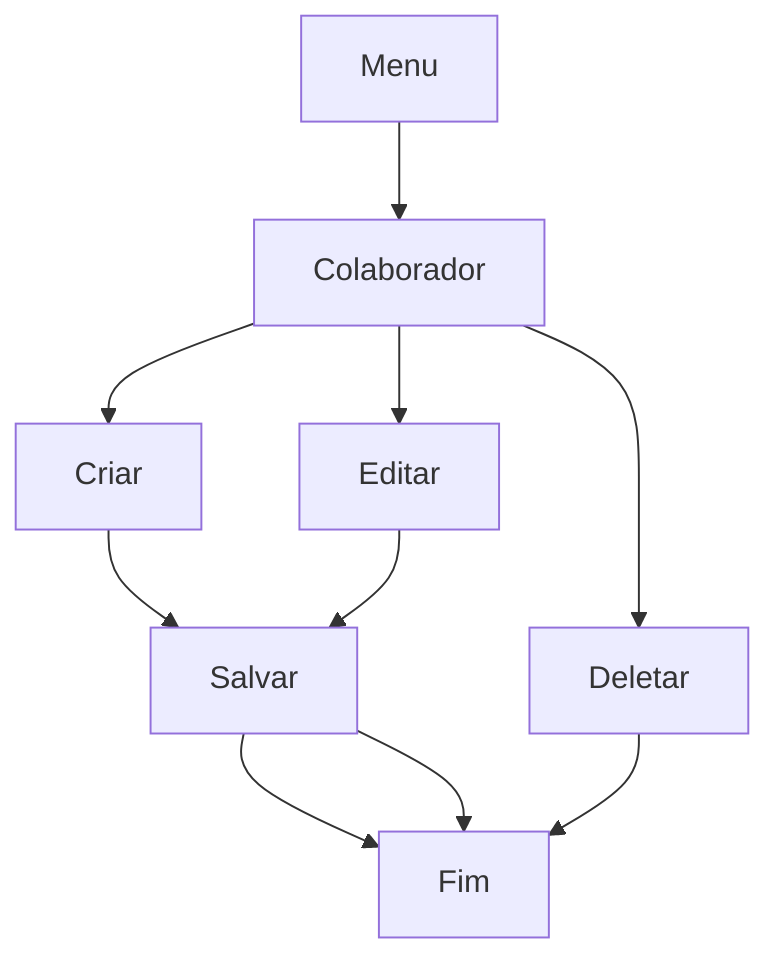

# Projeto EPI

Sistema desenvolvido com o objetivo de obter a pontuação para conclusão da matéria de Desenvolvimento de Sistemas do curso técnico da Instituição SENAI.

---

## Descrição

O **Projeto EPI** é um sistema de controle e emprestimo de EPIs que permite:

- Gerenciar equipamentos , colaboradores e emprestimos.
- Validação no login.
- Gerar relatório em PDF.

---

## ⚙️ Pré-requisitos

- Framework Django
- Bibliotecas instaladas
- Python 3.13.5 ou superior
- SQLite
- Git

---

## 📦 Instalação

### 1. Baixe o repositorio em sua maquina local com git clone.

### 2. Acesse o diretório do projeto

### 3. Instale o Django com o comando

> `pip install django`

### 4. Instale as dependencias

> `pip install -r requirements.txt`

### 5. Por fim execulte a aplicação

> `python manage.py runserver`

---

## Após a instalação, para logar no sistema pode ser utlizado as seguintes credenciais para teste.

Email: admin@admin.com
Senha: 1234

---
# Casos de uso
---

Diagrama de colaborador:

